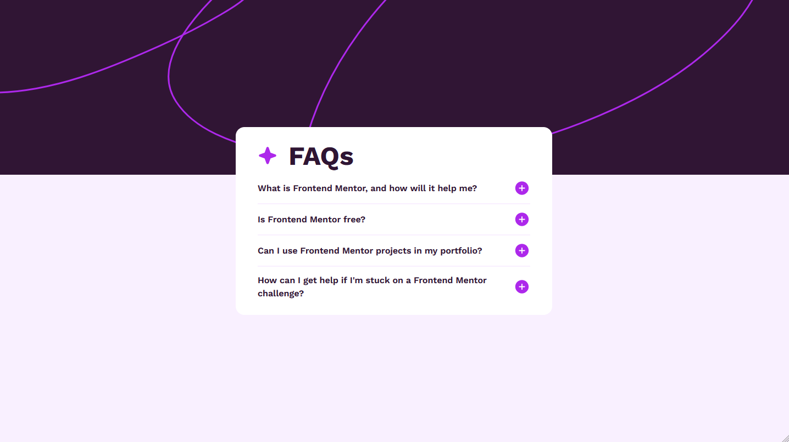
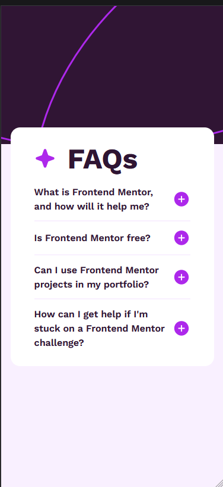

# Frontend Mentor - FAQ accordion solution

This is a solution to the [FAQ accordion challenge on Frontend Mentor](https://www.frontendmentor.io/challenges/faq-accordion-wyfFdeBwBz). Frontend Mentor challenges help you improve your coding skills by building realistic projects. 

## Table of contents

- [Overview](#overview)
  - [The challenge](#the-challenge)
  - [Screenshot](#screenshot)
  - [Links](#links)
- [My process](#my-process)
  - [Built with](#built-with)
  - [What I learned](#what-i-learned)
  - [Continued development](#continued-development)
  - [Useful resources](#useful-resources)
- [Author](#author)
- [Acknowledgments](#acknowledgments)

**Note: Delete this note and update the table of contents based on what sections you keep.**

## Overview

### The challenge

Users should be able to:

- Hide/Show the answer to a question when the question is clicked
- Navigate the questions and hide/show answers using keyboard navigation alone
- View the optimal layout for the interface depending on their device's screen size
- See hover and focus states for all interactive elements on the page

### Screenshot

Desktop Preview

Mobile Preview

### Links

- Solution URL: [Frontend Mentor Solution Page](https://www.frontendmentor.io/profile/Mnaqor66/solutions)
- Live Site URL: [live site URL](https://your-live-site-url.com)

## My process

### Built with

- Semantic HTML5 markup
- Tailwind CSS
- Mobile-first workflow
- Javascript DOM

### What I learned

From this challenge I learned to use Tailwind CSS, where tailwind CSS is something that I have just used after all this time I have continuously used Bootstrap, I learned it from the installation stage to configuration to how to use the classes in Tailwind CSS.

Besides that, I also learned how to use Javascript DOM for object manipulation.

### Continued development

I haven't thought about the continuation of this project, if you have an idea for the continuation of this project you can contact me.

### Useful resources

- [Tailwind CSS Documentation](https://tailwindcss.com/docs/installation) - This official website of Tailwind CSS is very helpful for me in understanding the use of Tailwind CSS.
- [Stack Overflow](https://stackoverflow.com/) - This site helps me deal with issues such as bugs that occur.
- [W3School](https://www.w3schools.com/) - This site helps me to understand how Javascript DOM works through javascript course

## Author

- Frontend Mentor - [@Mnaqor66](https://www.frontendmentor.io/profile/Mnaqor66)
- Twitter - [@NaufalAbqori3](https://x.com/NaufalAbqori3)